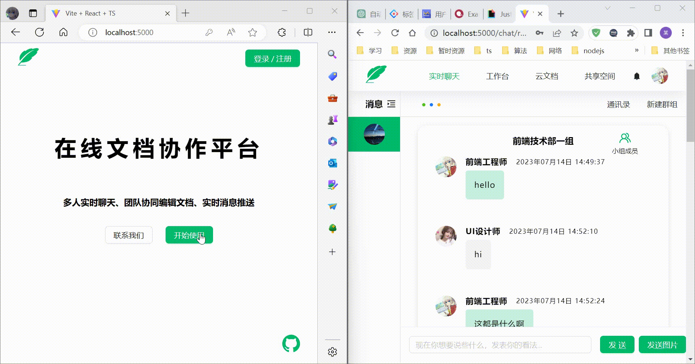
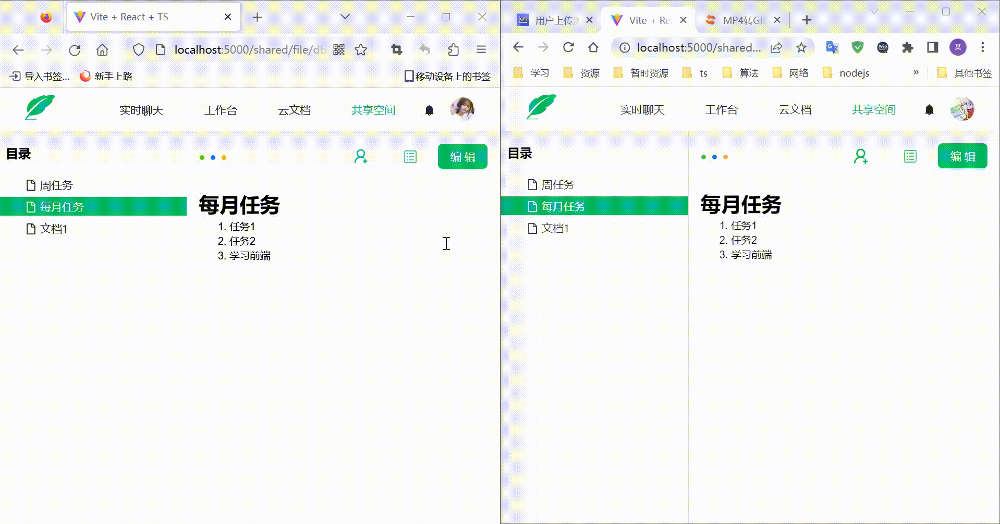
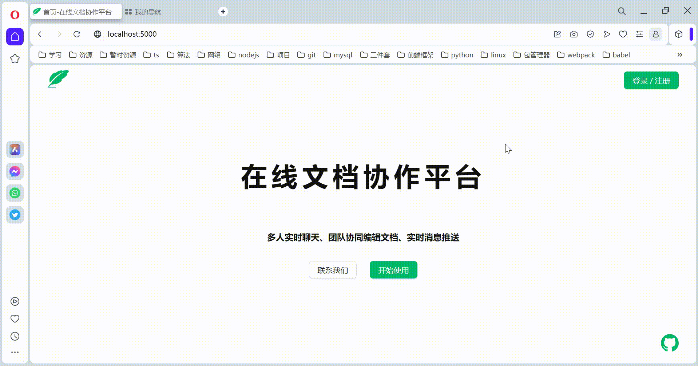

# Collaborative-app
## Introduction
A web system that can be used to chat with many people and edit documents in real time.

---
## Start
1. nest-server的根目录下新建.env配置文件，配置格式如下：
   - SECRET_KEY=[your secret_key]
   - DATABASE_URL="mysql://用户名:密码@主机:端口号/数据库名称"。
2. 安装服务端依赖：yarn install
3. 启动服务端：yarn run start:dev
4. 安装客服端依赖：yarn install
5. 启动客服端：yarn run dev
6. 访问地址：[127.0.0.1:5000](127.0.0.1:5000)

## Features
- 群聊
- 私聊
- 云文档
- 共享云文档
- 协同编辑文档
- 用户在线离线状态
- 黑夜模式切换

## Lib
- react
- nestjs
- yjs
- y-webrtc
- socket.io

## Todos
- 后台管理
- 工作台

## Project screenshot
- **首页**

- **私聊**

- **群聊**

- **共享云文档**

- **协同编辑**

- **黑夜模式**

  
## Notice
> y-webrtc的信令服务器为官方提供的示例

